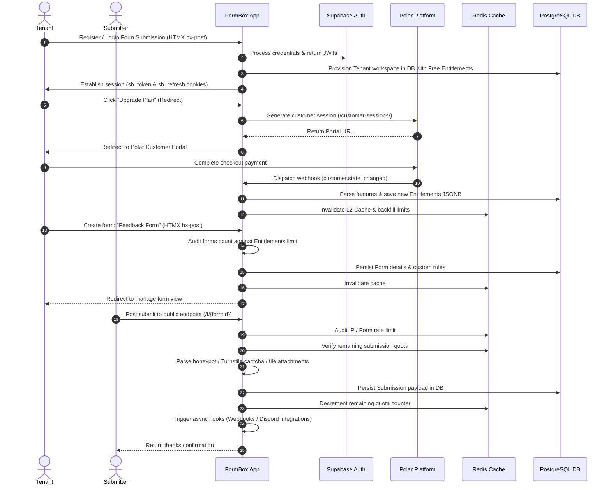

# Global Architecture & System Flows

This document synthesizes FormBox's macro design, class layouts, system-wide data flows, and global exception mapping.

## 1. Codebase Component Directory Structure

The project follows a standard Spring Boot layout mixed with Kotlin bridges:

```
src/main/
├── java/in/hridaykh/formbox/
│   ├── billing/                  # Monetization & Quotas (Polar Integration)
│   │   ├── controller/           # Webhook ingestion & Billing portal redirect endpoints
│   │   ├── model/                # Records representing ActiveSubscriptions, Entitlements, Meters
│   │   └── service/              # Entitlements caching, Meter counters, Webhook parsing
│   ├── config/                   # Configuration beans (Redis scripts, Polar client, properties)
│   ├── constant/                 # Views, Paths, and Cache keys registry constants
│   ├── controller/               # Spring MVC Page & Fragment Controllers (Auth, Dashboard, Forms)
│   ├── exception/                # Application exceptions and GlobalExceptionHandler
│   ├── filter/                   # CORS, IP Rate-limiting, and SupabaseSessionFilter
│   ├── model/
│   │   ├── dto/                  # DTO payloads for caching, requests, and tier validations
│   │   └── entity/               # Database Entities: Tenant, Form, Submission (JPA)
│   ├── repository/               # Database Query interfaces (TenantRepository, FormRepository, etc.)
│   └── service/                  # Core Business Services (Auth, Tenant onboarding, Caching)
└── kotlin/in/hridaykh/formbox/
    └── AuthServiceKt.kt          # Coroutines bridge to the Supabase Kotlin SDK
```

---

## 2. Complete User Journey Data Flow

Below is a lifecycle map depicting a tenant starting from registration, upgrading their plan via Polar, creating a form, and receiving submissions.



---

## 3. Global Exception Handling & HTMX Friendly Responses

FormBox handles application errors centrally to prevent server failures from interrupting client interfaces:

- **Component:** [GlobalExceptionHandler](file:///home/hridaykh/Code/hriday_tech/formbox/src/main/java/in/hridaykh/formbox/exception/GlobalExceptionHandler.java)
- **Spring Mapping:** Annotated with `@ControllerAdvice` to intercept exceptions system-wide.

### Intercepted Errors
- **`NoResourceFoundException` / `FormNotFoundException`:** Responds with a `404 Not Found` payload status.
- **`MultipartException` / Malformed files uploads:** Returns a `400 Bad Request` explaining download interruptions.
- **`AuthRestException` / `TokenExpiredException`:** Translates Supabase authentication API codes into user-friendly descriptions (e.g. Session Expired).
- **Generic `Exception.class`:** Fallback for internal server breakdowns.

### HTMX Alert Strategy
To keep the dashboard interface smooth when loading pages via HTMX:
1. The backend builds a `ModelAndView` target mapping to [error.html](file:///home/hridaykh/Code/hriday_tech/formbox/src/main/resources/templates/error.html) containing the fields `${errorTitle}`, `${errorMessage}`, and `${errorStatus}`.
2. The servlet response status code is explicitly set to **`HttpStatus.OK`** (`200`) using:
   ```java
   mav.setStatus(HttpStatus.OK);
   ```
3. Setting the status code to `200` ensures that HTMX processes the response body and swaps the error markup into the DOM container instead of triggering fallback generic network failure popups or ignoring the content.
