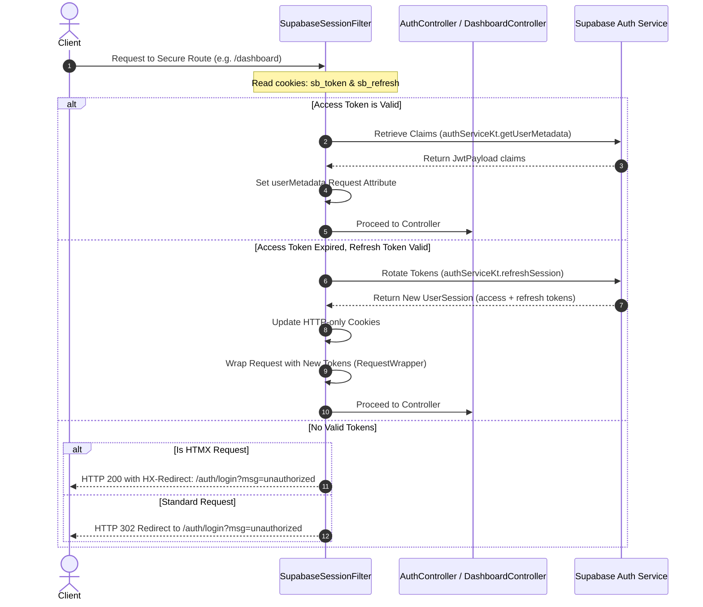

# Authentication & User Lifecycle Management

This document details the reverse-engineered authentication architecture, session propagation mechanisms, and endpoint workflows for the FormBox application.

## 1. Authentication Architecture (Supabase Integration)

FormBox implements a custom cookie-based authentication flow backed by **Supabase Auth** rather than Spring Security. The security boundaries and token management are enforced via Servlet Filters.



### Core Security Components

1. **`SupabaseSessionFilter` (extends `OncePerRequestFilter`)**
   - Intercepts incoming HTTP requests to evaluate user token validity.
   - Excludes public assets and specific public routes from filtering via `shouldNotFilter(...)`:
     - Excluded: `/favicon.ico`, `/assets/**`, `/f/**` (public form submission endpoints), `/polar/**` (billing webhooks), and `/error`.
     - Optional (filtered but allowed for anonymous requests): `/`, `/auth/**`.
   - Lifecycle management of the `SupabaseClient` instance: creates an isolated client for each request context (`authServiceKt.createIsolatedClient()`) and closes it inside a `finally` block (`authServiceKt.closeIsolatedClient(...)`).

2. **Token Rotation & Rotation Failures**
   - Automatically attempts to exchange the refresh token (`sb_refresh`) if the access token (`sb_token`) is missing or invalid.
   - If rotation fails (e.g., expired refresh token), the filter clears all local auth cookies and redirects the user to the login screen.

3. **`RequestWrapper`**
   - Re-packages requests after token rotation, embedding the updated credentials into cookie lookups for downstream handling.

---

## 2. Session & Context Propagation

Once verified, the user's authentication context is propagated from the filter to controllers and front-end templates:

- **Request Attributes:** The filter binds the decoded `JwtPayload` object into the servlet request under the name `"userMetadata"`.
- **Controller Access:** Spring MVC controllers extract the authenticated context using the `@RequestAttribute JwtPayload userMetadata` annotation.
- **Thymeleaf Template Context:** Controllers bind the payload properties into the Thymeleaf template model using:
  ```java
  model.addAttribute("user", userMetadata);
  ```
  Thymeleaf views (like `dashboard.html`) then render dynamic personalization strings such as `${user.email}` and conditional navigation items depending on whether the user context exists.

---

## 3. Endpoints & Views Mapping

The authentication routes are served by [AuthController.java](file:///home/hridaykh/Code/hriday_tech/formbox/src/main/java/in/hridaykh/formbox/controller/AuthController.java) under the `/auth` base path.

| Endpoint | Method | Input Parameters | HTMX Context | Response/Action |
| :--- | :--- | :--- | :--- | :--- |
| `/auth/login` | `GET` | `msg` (optional query param) | None (Standard Page Load) | Returns `auth/login` view. Redirects to `/dashboard` if an active session exists. Clears cookies if `msg` is set. |
| `/auth/signup` | `GET` | None | None (Standard Page Load) | Returns `auth/register` view. Redirects to `/dashboard` if an active session exists. |
| `/auth/signup` | `POST` | `email`, `password`, `cf-turnstile-response` | HTMX (`hx-post`) | Registers user via Supabase. On success, responds with `auth/fragments :: empty-frag` triggers `HX-Redirect` to `/auth/login?msg=check_email`. On error, returns `auth/fragments :: error-alert` mapped to `#alert-container`. |
| `/auth/login` | `POST` | `email`, `password`, `cf-turnstile-response` | HTMX (`hx-post`) | Authenticates user. Stores `sb_token` and `sb_refresh` HTTP-only cookies. On success, returns `auth/fragments :: empty-frag` with `HX-Redirect` to `/dashboard`. On error, returns `auth/fragments :: error-alert`. |
| `/auth/logout` | `POST` | `sb_token`, `sb_refresh` (cookies) | HTMX (`hx-post`) | Signs out user in Supabase, purges local cookies, and returns `auth/fragments :: empty-frag` with `HX-Redirect` to `/auth/login?msg=logged_out`. |
| `/auth/resend-confirmation` | `POST` | `email`, `cf-turnstile-response` | HTMX (`hx-post`) | Requests email verification re-dispatch from Supabase. Returns `auth/fragments :: success-alert` or `error-alert` to `#alert-container`. |
| `/auth/callback` | `GET` | None | None (Standard Callback) | Renders `auth/callback` page to capture OAuth hashes (hash fragment parameters parse and transition into POST callback). |
| `/auth/session-callback` | `POST` | `access_token`, `refresh_token`, `expires_in` | HTMX Context / Standard | Processes callback tokens to set auth cookies, creates free tier tenant if needed, and issues `HX-Redirect` to `/dashboard`. |

### Key Reactive Swaps (HTMX)
- **Forms Submission Targets:** Forms in `login.html` and `register.html` post asynchronously to `/auth/login`, `/auth/signup`, and `/auth/resend-confirmation`.
- **Target Container:** Target element is `#alert-container`, swapped with `innerHTML`.
- **Fragments Returned:**
  - `auth/fragments :: error-alert` when validation or credentials checks fail.
  - `auth/fragments :: success-alert` for resending confirmation success.
  - `auth/fragments :: empty-frag` (`<div th:fragment="empty-frag" hx-trigger="load" hx-redirect="/dashboard"></div>` or similar redirect logic via headers) to complete successful actions.
