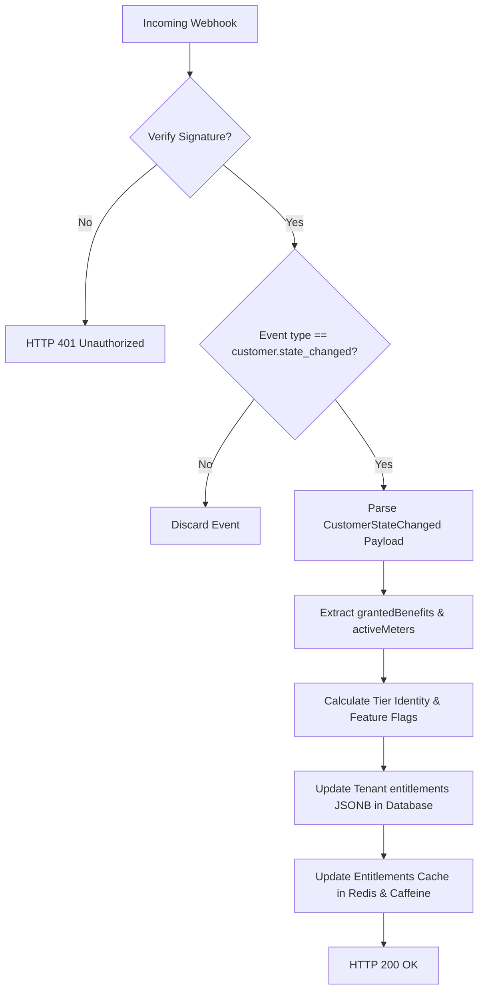

# Billing & Polar Integration

This document details the database structures, webhook parsing mechanisms, portal workflows, and feature gating utilized to monetize FormBox using the **Polar** platform.

## 1. Data Models

FormBox keeps a local cache of subscription details inside the PostgreSQL database using a single, schema-less JSONB architecture on the tenant entity.

### `Tenant` Entity (`tenants` table)
- **`id`** (`UUID`, Primary Key): Matches the Supabase user ID `sub` claim.
- **`email`** (`String`): Email address of the tenant.
- **`entitlements`** (`JSONB` mapped to `Entitlements` record): Stores feature flags and limits.

### `Entitlements` Model
Stored as a serialized snapshot directly within the `tenants` row:
- **Tiers & Metadata:**
  - `tier_name`: Name of the subscription plan (e.g. `"free"`, `"Pro"`, `"Enterprise"`).
  - `tier_priority`: Integer value used to prioritize features if multiple benefits are active.
  - `refresh_at`: Instant tracking when the next quota credit boundary is reached.
  - `recurring_interval`: `"free"`, `"month"`, `"year"`, or `"one_time"`.
- **System Resource Caps:**
  - `submissions_limit`: Max submissions allowed per cycle.
  - `forms_limit`: Max forms a tenant can construct.
  - `storage_limit_bytes`: Max storage cap for file uploads.
  - `max_file_size_bytes`: Max size permitted for a single file.
  - `max_rate_limit_rpm`: Rate limiting allowance in requests-per-minute.
- **Feature Flags:**
  - `turnstile_allowed`, `redirect_urls_allowed`, `json_forms_allowed`, `file_uploads_allowed`, `field_validations_allowed`, `csv_exports_allowed`, `email_digests_allowed`, `altcha_allowed`, `discord_notifs_allowed`, `slack_notifs_allowed`, `telegram_notifs_allowed`, `custom_webhooks_allowed`.

---

## 2. Webhook Ingestion & Processing

FormBox relies entirely on Polar's webhook system to synchronize subscription states.

### Ingestion Point
- **Controller:** [PolarWebhookController](file:///home/hridaykh/Code/hriday_tech/formbox/src/main/java/in/hridaykh/formbox/billing/controller/PolarWebhookController.java)
- **Path:** `/polar`
- **Verification:** Cryptographically verified using `PolarWebhookVerifier.verify(body, webhookId, timestamp, signature)`.
- **Testing:** Local test endpoint is available at POST `/webhooks/polar/test`.

### Event Mapping & Resolution
FormBox listens for a single event type: **`customer.state_changed`**. The incoming JSON payload is mapped to [CustomerStateChanged](file:///home/hridaykh/Code/hriday_tech/formbox/src/main/java/in/hridaykh/formbox/billing/model/CustomerStateChanged.java).



#### Quota & Feature Resolution Logic in `WebhookService`
1. **Tier Identity:** Checks `grantedBenefits()` metadata. If a benefit contains `tier_priority`, the plan with the highest priority is resolved as the active tier.
2. **Boolean Flags:** Enabled if a benefit contains a corresponding `feature_key` metadata value matching the feature name.
3. **Caps & Numeric Limits:** Iterates over benefits to extract keys starting with `limit_key` (e.g. `forms_limit`), tracking the highest `limit_value`.
4. **Meter Limits (Submissions):** Native Polar meters are evaluated under `activeMeters()`. The meter whose ID matches the value of `polar-ids.submission-meter-id` is utilized, updating `submissionsLimit` to the value of `creditedUnits`.
5. **Cycle Boundaries & Refresh Calculation:**
   - Monthly Subscriptions: Quotas reset at `currentPeriodEnd`.
   - Annual/Longer Subscriptions: Quotas are set to refresh at monthly intervals computed from `currentPeriodStart` plus increments of 30 days.
   - Lifetime / Free: Refreshes 30 days from the current date.

---

## 3. Checkout & Billing Portal Flows

Billing actions are handled via [BillingController](file:///home/hridaykh/Code/hriday_tech/formbox/src/main/java/in/hridaykh/formbox/billing/controller/BillingController.java):

1. **Portal Generation Route:** `GET /billing/portal` & `GET /billing/upgrade`.
2. **User Onboarding / Provisioning:** If a free-tier user attempts to open the portal, the application verifies their presence on the Polar payment system via `tenantService.ensurePolarCustomerExists()`. If they do not exist, a customer account is created with `external_id` mapping to the tenant ID.
3. **Session Token & Redirect:** Calls `/customer-sessions/` via `PolarHttpClient` containing the parameter `external_customer_id`. The client is redirected to the returned `customerPortalUrl()`.
4. **HTMX Requests Compatibility:** If the request contains the `HX-Request` header, the controller issues the redirect using the `HX-Redirect` response header rather than returning an standard HTTP 302 redirect.

---

## 4. Frontend State & Gating

Subscription gating is implemented both on the backend and in the Thymeleaf view layers:

- **Submissions Remaining Counter:** The dashboard template displays the remaining submissions balance (`balanceLeft`), which is retrieved via `polarCacheService.getCachedSubmissionBalance(tenantId)`. This balance is cached in Redis with a 2-hour TTL and decremented atomically on new form submissions.
- **Form Endpoints Limitation:** `FormController.createForm()` checks the tenant's current form count. If the limit is reached (`forms.size() >= entitlements.formsLimit()`), it cancels form generation and responds with an `HX-Redirect` containing an upgrade warning.
- **Custom Redirect Gating:** The "Create Form" modal disables the URL input if `redirectUrlNotAllowed` is true:
  ```html
  <input id="form-redirect" name="redirectUrl" type="url" th:disabled="${redirectUrlNotAllowed}"/>
  ```
- **Form Settings Gating:** In `FormController.manageForm()`, boolean restriction flags are evaluated and added to the model:
  - `redirectUrlNotAllowed`
  - `fieldValidationsNotAllowed`
  - `turnstileNotAllowed`
  - `jsonFormsNotAllowed`
  - `fileUploadsNotAllowed`

These flags are checked in `manage-form.html` to lock settings inputs and display a premium feature banner directing users to `/billing/upgrade`.
