# Billing & Account UI Flows (HTMX + Thymeleaf)

Map out the end-to-end interactive flows for billing state changes. Because this is an HTMX codebase, track the complete request-response cycle instead of just backend code.

### 1. The Subscription Lifecycle Flow
The sequence of a user upgrading their tier or accessing the billing portal:

```mermaid
sequenceDiagram
    actor User as User Browser
    participant App as Spring App (BillingController)
    participant Redis as Redis L2 Cache
    participant Polar as Polar API Engine
    participant DB as Postgres DB

    User->>App: GET /billing/upgrade (Click Upgrade/Manage Billing)
    rect rgb(30, 30, 40)
        Note over App,Polar: Lazy Provisioning (if Free Tier)
        App->>Polar: GET /customers/v1/ (Check external customer mapping)
        Polar-->>App: Not Found (or returns Customer record)
        App->>Polar: POST /customers/v1/ (Create Polar Customer matching external_id)
        Polar-->>App: Customer Created
    end
    App->>Polar: POST /customer-sessions/ (Request Portal URL with external_customer_id)
    Polar-->>App: Return Portal URL
    alt Request contains HX-Request Header
        App-->>User: HTTP 200 with HX-Redirect header
    else standard browser navigation
        App-->>User: HTTP 302 Redirect to Portal URL
    end
    User->>Polar: Redirected to Polar Customer Portal
    Note over User,Polar: User updates plan or payment method
    Polar->>App: POST /polar (customer.state_changed Webhook)
    App->>DB: Save updated Entitlements JSONB to Tenant
    App->>Redis: Update entitlements & reset submission balance
    Polar-->>User: Subscription Success / Active
```

### 2. HTMX Integration Matrix
Interactive billing and configuration components:

- **Component**: Load Form Endpoints Table
  - **Thymeleaf Template File**: [dashboard.html](file:///home/hridaykh/Code/hriday_tech/formbox/src/main/resources/templates/dashboard.html)
  - **HTMX Trigger & Target**: `hx-get="/forms" hx-trigger="load" hx-target="#endpoints-tbody" hx-swap="innerHTML"`
  - **Spring Boot Endpoint**: `FormController.listForms` inside [FormController.java](file:///home/hridaykh/Code/hriday_tech/formbox/src/main/java/in/hridaykh/formbox/controller/FormController.java#L86-L102)

- **Component**: Create New Form Modal Form
  - **Thymeleaf Template File**: [dashboard.html](file:///home/hridaykh/Code/hriday_tech/formbox/src/main/resources/templates/dashboard.html#L137-L183)
  - **HTMX Trigger & Target**: `hx-post="/forms" hx-target="#endpoints-tbody" hx-swap="beforeend"`
  - **Spring Boot Endpoint**: `FormController.createForm` inside [FormController.java](file:///home/hridaykh/Code/hriday_tech/formbox/src/main/java/in/hridaykh/formbox/controller/FormController.java#L45-L84)

- **Component**: Delete Form Action
  - **Thymeleaf Template File**: [form-list.html](file:///home/hridaykh/Code/hriday_tech/formbox/src/main/resources/templates/fragments/form-list.html#L18-L26)
  - **HTMX Trigger & Target**: `hx-trigger="click" th:hx-delete="|/forms/${form.id}|" th:hx-target="'#' + |form-row-${form.id}|" hx-swap="outerHTML"`
  - **Spring Boot Endpoint**: `FormController.deleteForm` inside [FormController.java](file:///home/hridaykh/Code/hriday_tech/formbox/src/main/java/in/hridaykh/formbox/controller/FormController.java#L191-L208)

- **Component**: Save Form Settings configurations (with plan tier validation)
  - **Thymeleaf Template File**: [manage-form.html](file:///home/hridaykh/Code/hriday_tech/formbox/src/main/resources/templates/dashboard/manage-form.html#L1050-L1211)
  - **HTMX Trigger & Target**: `th:attr="hx-put=|/forms/${form.id}|" hx-target="#settings-panel-container" hx-swap="innerHTML"`
  - **Spring Boot Endpoint**: `FormController.updateForm` inside [FormController.java](file:///home/hridaykh/Code/hriday_tech/formbox/src/main/java/in/hridaykh/formbox/controller/FormController.java#L138-L190)

### 3. Error & Edge Case Handling
- **Billing Tier Constraint Enforcement**:
  - When a user submits configurations exceeding their current plan (e.g. adding custom redirect URL, Turnstile secret, JSON api configuration on the free tier), [FormTierValidator](file:///home/hridaykh/Code/hriday_tech/formbox/src/main/java/in/hridaykh/formbox/util/FormTierValidator.java) intercepts, reverts disallowed fields to default/null, and records a warning message.
  - The controller returns the updated settings fragment containing warning blocks. The Thymeleaf markup renders this via alert cards: `th:if="${warnings != null and !#lists.isEmpty(warnings)}"`.
- **Session/Token Expiration**:
  - If authentication session token is expired, [SupabaseSessionFilter](file:///home/hridaykh/Code/hriday_tech/formbox/src/main/java/in/hridaykh/formbox/filter/SupabaseSessionFilter.java#L107-L120) intercepts the request.
  - If it is an HTMX request (`HX-Request` header is `"true"`), it returns a custom response header `HX-Redirect` pointing to the login route. This forces HTMX to perform a full-browser redirect to the login page rather than swapping the login markup inside an inner page container.

### 4. UI Overcomplications & Mismatches to Flag
Review of HTML templates and HTMX attributes reveals:
- **Broken Out-of-Band (OOB) Swap Bug**:
  - In [manage-form.html](file:///home/hridaykh/Code/hriday_tech/formbox/src/main/resources/templates/dashboard/manage-form.html#L1020), the update response attempts to update the main page title out-of-band:
    `<h1 id="form-heading-settings" hx-swap-oob="true" th:text="'Managing: ' + ${form.name}" style="display: none;">`
  - However, the actual page header title element has the ID `form-heading` (not `form-heading-settings`):
    `<h1 id="form-heading" th:text="'Managing: ' + ${form.name}">`
  - Because of this ID mismatch, the out-of-band title swap **fails to update** the visible page title when a form's name is saved.
- **Dead HTMX Redirect Code in Billing Portal**:
  - In [BillingController](file:///home/hridaykh/Code/hriday_tech/formbox/src/main/java/in/hridaykh/formbox/billing/controller/BillingController.java#L81-L83), the controller contains special logic to output `HX-Redirect` response headers if the client is an HTMX-based caller.
  - However, in [dashboard.html](file:///home/hridaykh/Code/hriday_tech/formbox/src/main/resources/templates/dashboard.html#L50-L54), the upgrade and manage billing links are standard `<a>` anchor tags without any `hx-get`/`hx-post` elements. The HTMX-specific redirect logic in the controller is currently dead code.
- **No Webhook Progress Indicators**:
  - Since there is no HTMX polling mechanism (`hx-trigger="every Xs"`) after payment checkout, if a user finishes payment on Polar and returns to the app before the Polar webhook triggers local state updates, the dashboard will display stale status. The user must manually reload the page.