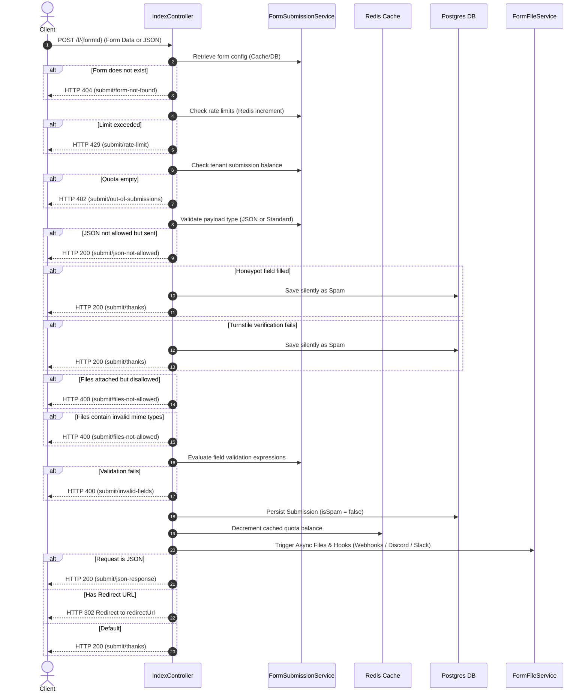

# Forms & Submissions (Core Architecture)

This document details the reverse-engineered Form Engine modeling, submission pipeline, validation phases, and the HTMX interaction matrix.

## 1. The Form Engine

Forms are defined as database entities that control validation, security headers, limits, and feature flags.

### Database Schema Mappings

#### `Form` Entity (`forms` table)
- **`id`** (`UUID`, Primary Key): Uniquely identifies the endpoint target.
- **`tenant_id`** (`UUID`, Foreign Key): Belongs to a specific tenant workspace.
- **`name`** (`String`): Descriptive name for the dashboard view.
- **`redirect_url`** (`String`, Nullable): Custom URL redirect target for standard HTML form submissions.
- **`honeypot_name`** (`String`, Nullable): Invisible input name to decoy spam bots.
- **`turnstile_secret_key`** (`String`, Nullable): Private key used to verify Cloudflare Turnstile tokens.
- **`rate_limit_rpm`** (`Integer`): Maximum requests-per-minute allowed for the form endpoint.
- **`allow_files`** (`Boolean`): Allows multipart file attachments.
- **`allow_json`** (`Boolean`): Accepts JSON request payloads.
- **`allow_htmx`** (`Boolean`): Enables HTMX-friendly responses.
- **`is_active`** (`Boolean`): Toggle to enable or disable the endpoint.
- **`field_validations`** (`JSONB` / Array of Strings): Custom criteria expressions for field validation checks.

#### `Submission` Entity (`submissions` table)
- **`id`** (`UUID`, Primary Key): Submission identifier.
- **`form_id`** (`UUID`, Foreign Key): Associated Form.
- **`payload`** (`JSONB` Map): Key-value pairs containing user submitted inputs.
- **`remote_addr`** (`String`): Originating IP address of the sender.
- **`is_spam`** (`Boolean`): Flag indicating if the submission failed spam checks.
- **`created_at`** (`OffsetDateTime`): Capture time of submission.

---

## 2. Submission Pipeline Lifecycle

When a public client posts to `/f/{formId}`, the request undergoes a structured validation, logging, and dispatch pipeline:

---

## 3. HTMX Interaction Matrix (Dashboard)

The forms dashboard relies on HTMX for responsive updates, page navigation, and options setting swaps.

| User Action | Triggering Element | HTMX Attribute | Target Element | Swap Method | Spring Controller Endpoint | Returned Thymeleaf Fragment |
| :--- | :--- | :--- | :--- | :--- | :--- | :--- |
| **List Forms** | Endpoints Container | `hx-get="/forms"` `hx-trigger="load"` | `#endpoints-tbody` | `innerHTML` | `GET /forms` in `FormController` | `fragments/form-list :: form-rows` |
| **Create Form** | New Form Modal Submit | `hx-post="/forms"` | `#endpoints-tbody` | `beforeend` | `POST /forms` in `FormController` | `auth/fragments :: empty-frag` (Sets `HX-Redirect` header) |
| **Delete Form** | Delete Button click | `hx-delete` (Client Script trigger or direct mapping) | Modal Dismiss / List refresh | OOB / Direct | `DELETE /forms/{id}` in `FormController` | `void` (Sends HTTP 200) |
| **Update Settings** | Form Settings Submit | `hx-put` | `#settings-panel-container` | `innerHTML` | `PUT /forms/{id}` in `FormController` | `dashboard/manage-form :: settings-panel` (OOB heading swap: `#form-heading-settings`) |
| **Logout** | Logout header button | `hx-post="/auth/logout"` | Window Redirect | header `HX-Redirect` | `POST /auth/logout` in `AuthController` | `auth/fragments :: empty-frag` (triggers redirect to `/auth/login`) |
