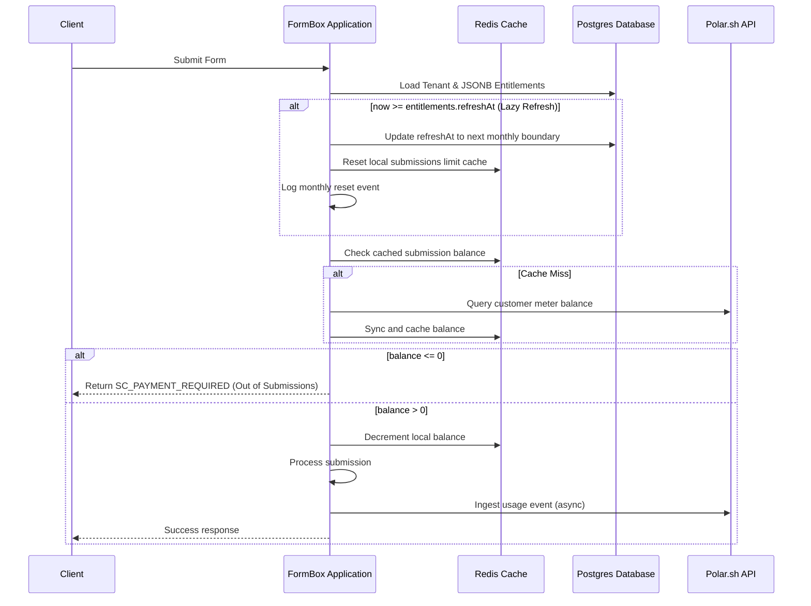

# Billing Redesign Walkthrough

We have successfully migrated the entire billing integration and design to **Polar.sh**! The new system uses a dynamic, robust JSONB-backed architecture, eliminating local tracking tables in favor of Polar as the single source of truth.

---

## 1. Core Architecture Overview

---

## 2. Key Accomplishments

### Phase 1: Webhook Integration & JSONB Entitlements
- **Dynamic Mapping**: Replaced static database tables (`polar_products`, `purchases`) and static features configuration (`features.json`, `Tiers.java`) with a dynamic mapping processor in [WebhookService.java](file:///home/hridaykh/Code/hriday_tech/formbox/src/main/java/in/hridaykh/formbox/billing/service/WebhookService.java).
- **Meters Integration**: Ingested submissions count limit dynamically using the meter ID in `polar-ids.submission-meter-id` from Polar's native `activeMeters` payload.
- **Onboarding On-the-Fly**: Integrated free tier default entitlements in [TenantService.java](file:///home/hridaykh/Code/hriday_tech/formbox/src/main/java/in/hridaykh/formbox/service/TenantService.java) on user signup, letting users use the app immediately before the Polar webhook round-trips.

### Phase 2: Lazy Entitlement Refresh
- **Scheduler-free Reset**: Wrote lazy refresh checks inside [PolarCacheService.java](file:///home/hridaykh/Code/hriday_tech/formbox/src/main/java/in/hridaykh/formbox/billing/service/PolarCacheService.java) at the start of submissions balance checking.
- **Automatic Boundary Adjustments**: If `now >= refreshAt`, the system automatically increments `refreshAt` by 30 days and resets the local Redis submissions limit balance to `submissionsLimit`.
- **Plan Interval Support**: Added `recurringInterval` to `Entitlements` to track subscription intervals (`month`, `year`, `one_time`, `free`) to cleanly separate auto-refreshing plans from manual/locally-refreshed ones (Annual, LTD).

### Phase 3: Migration of Consumers
- **[TenantCacheService](file:///home/hridaykh/Code/hriday_tech/formbox/src/main/java/in/hridaykh/formbox/service/cache/TenantCacheService.java)**: Changed cache retrieval to resolve active tiers directly from the JSONB entitlements property in the `Tenant` database row.
- **[BillingController](file:///home/hridaykh/Code/hriday_tech/formbox/src/main/java/in/hridaykh/formbox/billing/controller/BillingController.java)**: Replaced legacy `Tiers` check class calls with direct string checks. Integrated dynamic Polar product checkout mapping using `/products/` endpoint and Spring caching to support checkout intervals.
- **[DashboardController](file:///home/hridaykh/Code/hriday_tech/formbox/src/main/java/in/hridaykh/formbox/controller/DashboardController.java)**: Replaced `Tiers` lookup with dynamic entitlements check to render dashboard features (such as custom redirect allowed status) based on active features flags.
- **[FormController](file:///home/hridaykh/Code/hriday_tech/formbox/src/main/java/in/hridaykh/formbox/controller/FormController.java)** & **[IndexController](file:///home/hridaykh/Code/hriday_tech/formbox/src/main/java/in/hridaykh/formbox/controller/IndexController.java)**: Replaced `Tiers` validations with checking `entitlements.formsLimit()` and `entitlements.redirectUrlsAllowed()`.
- **[FormTierValidator](file:///home/hridaykh/Code/hriday_tech/formbox/src/main/java/in/hridaykh/formbox/util/FormTierValidator.java)**: Rewrote settings validations (Turnstile keys, JSON forms allowed, max file size, and rate limits) to be evaluated directly against the tenant's entitlements.

### Phase 4: Webhook Cleanup
- **Simplified Processing**: Refactored [PolarWebhooksService.java](file:///home/hridaykh/Code/hriday_tech/formbox/src/main/java/in/hridaykh/formbox/billing/service/PolarWebhooksService.java) to listen only to the `"customer.state_changed"` webhook event. All other legacy subscription and benefit-grant events are logged and ignored.
- **Zero Local DB Products**: Removed all dependency references to legacy local database repositories (`PolarProductsRepository`, `PurchasesRepository`).

---

## 3. Deprecated Files for Cleanup

Per your instructions, **no files have been deleted** from the filesystem yet. You can now safely delete the following files since they are completely unreferenced and dead code:

1. **`in/hridaykh/formbox/constant/Tiers.java`**
   - *Reason*: Replaced by JSONB `Entitlements` properties.
2. **`in/hridaykh/formbox/model/tier/TierFeatures.java`**, **`MeterQuota.java`**, **`NotificationFeatures.java`**
   - *Reason*: Replaced by the native properties on the JSONB `Entitlements` record.
3. **`src/main/resources/features.json`**
   - *Reason*: Features are now defined as Feature Flags inside the Polar dashboard.
4. **`in/hridaykh/formbox/billing/model/Purchases.java`** & **`PolarProducts.java`**
   - *Reason*: We no longer store purchases or products in the local database.
5. **`in/hridaykh/formbox/billing/PurchasesRepository.java`** & **`PolarProductsRepository.java`**
   - *Reason*: Database access layers are no longer needed for purchases/products.
6. **Postgres Tables: `purchases` and `polar_products`**
   - *Reason*: Can be dropped from your database client since they have been removed from JPA mapping files.

---

## 4. Tenant Onboarding on Login (Fix)

- **Bug**: Credential-based login via `loginUser` did not trigger tenant onboarding/creation (`tenantService.getOrCreateTenantWithFreeSubscription(userMetadata)`), unlike the OAuth flow. This caused subsequent database inserts (such as creating a new form) to fail with a foreign key constraint violation on `forms_tenant_id_fkey` as the tenant row didn't exist in the database.
- **Fix**: Updated `loginUser` in [AuthService.java](file:///home/hridaykh/Code/hriday_tech/formbox/src/main/java/in/hridaykh/formbox/service/AuthService.java) to resolve `userMetadata` and perform the tenant onboarding setup immediately upon successful authentication.
